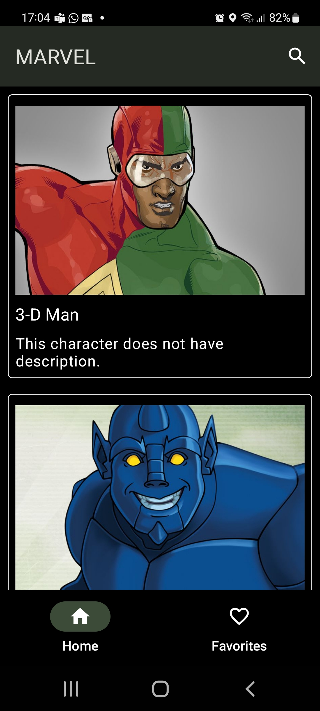
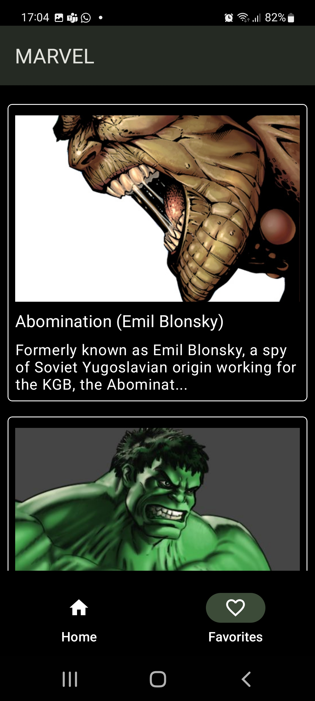
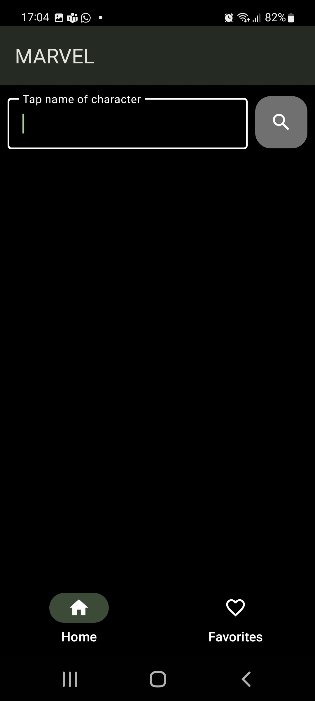

# Coin Converter App 

This app consumes data from a marvel API. To show a list of Marvel characters. I made this with a learning purpose. I also use the new features in Material Design 3 allowing an application's user interface to be themed dynamically based on the user's wallpaper.

Technologies: 

- kotlin
- MVVM
- Hilt
- Room
- Coroutines 
- Retrofit

Feel free to look, I am open to tips and suggestions.

 

 